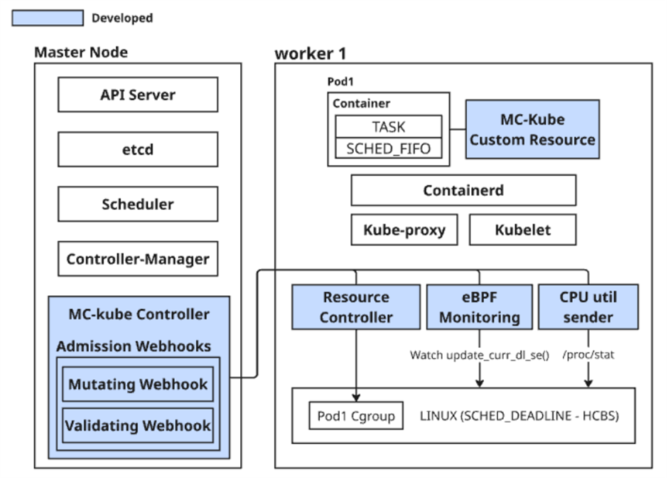

# MC-Kube: Mixed-Criticality Workload Management for Kubernetes

[](https://opensource.org/licenses/Apache-2.0)
[](https://kubernetes.io/)
[](https://goreportcard.com/report/github.com/hufs-ese-lab/MC-Kube)

**MC-Kube** is a Kubernetes operator designed for **mixed-criticality real-time workloads** (e.g., autonomous driving, industrial IoT). It overcomes the limitations of the default CFS scheduler by integrating a **hierarchical-CBS kernel patch** and **eBPF-based overrun detection**, ensuring strong temporal guarantees with minimal overhead.

> 📄 **Paper**: [SDV에서의 Mixed-Criticality Task Orchestrator](./attached/paper.pdf) (Submitted to HUFS, 2025)

## Key Features
- **⚡ Zero-Overhead Monitoring**: eBPF-based detection with **246× lower latency** (299µs) compared to API polling.
- **🛡️ Strong Isolation**: Container-level `SCHED_DEADLINE` support via custom Kernel patches.
- **🧠 Adaptive Orchestration**:
  - **Runtime Escalation**: Automatically boosts runtime (`runtime_low` → `runtime_hi`) upon deadline miss.
  - **Smart Preemption**: Migrates high-criticality tasks to secure cores by preempting lower-priority pods.
- **📈 Proven Performance**: Achieved **86% reduction in deadline misses** in high-load scenarios.

## Architecture


## Quick Start

### Prerequisites
- Kubernetes v1.34+ Cluster
- **Linux Kernel v6.13+** with [hierarchical-CBS patch](https://github.com/hufs-ese-lab/HCBS-patch/tree/for-mc-kube) (REQUIRED)
- `kubectl`, `docker`

### Installation
Deploy the MC-Kube operator and CRDs in one go:

```sh
# 1. Install CRDs & Operator
make install
make deploy IMG=ghcr.io/hufs-ese-lab/mc-kube:v1

# 2. Check Deployment
kubectl get pods -n mc-kube-system
```

### Usage Example
Apply a sample mixed-criticality workload:


```Bash
kubectl apply -k config/samples/
```
To verify the real-time configuration applied to the container:

```Bash
kubectl exec <pod-name> -- cat /sys/fs/cgroup/cpu.rt_multi_runtime_us
```
### Performance & Reproducibility
Our experiments show that MC-Kube significantly outperforms standard kubernetes under heavy loads.

Reproduce the experiments:

```Bash
# Run scenarios
kubectl apply -f config/samples/test-preemption-scenario.yaml

# Monitor status
kubectl get mckubes -o wide
```

### License
This project is licensed under the Apache 2.0 License.

**Research Group**: ESE Lab, Hankuk University of Foreign Studies